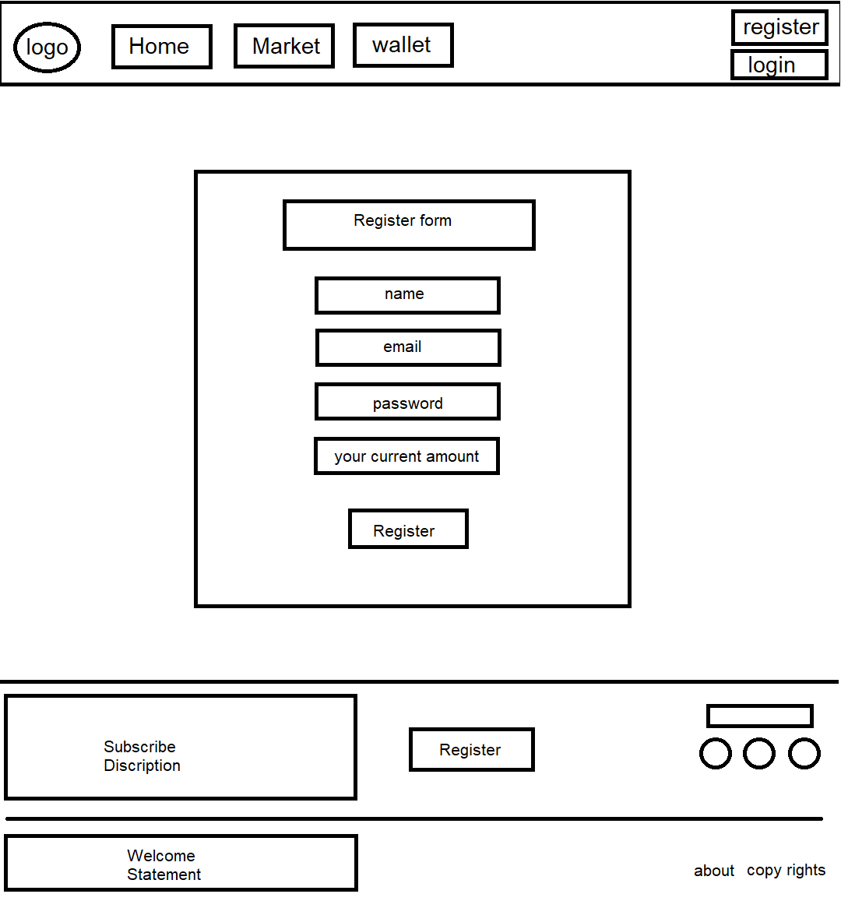

# Cryptocurrency

## Members Names:
1. Ahmed Zatar
2. Hala khamayseh
3. Aseel Farrar
4. Ebrahim Ayyad
5. obada Alhawjreh

## Project description:
What is Cryptocurrency :A web application project that allows you to simulate investment in cryptocurrency .

## Problem Domain:

1. Learning how to investment in cryptocurrency.
2. Simulate investment in cryptocurrencies without any worries.

## User Stories:

### Feature1:
 As a user, I want a personnel accounts ,I can login into  with Email and password.
### Feature2:
 As a user, I want to a specific details about the coins with ability to buy and sell.
### Feature3:
 As a user, I want to show interactive homepage with top five coins and trending cryptocurrency news.
### Feature4:
 As a user, I want to see graphic dynamic chart that explain price  updating per the time.
### Feature5:
As a user, I want to show my balance ( credit and the coins that I buy it ).

## Trello link:
[trello](https://trello.com/b/T8db5O8H/cryptocurrency)

## Domain Modeling

## Relationship Diagram

## Wireframe

 

